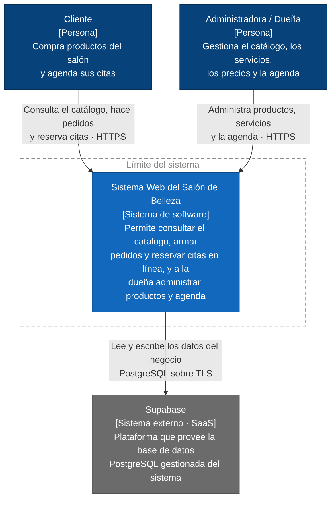
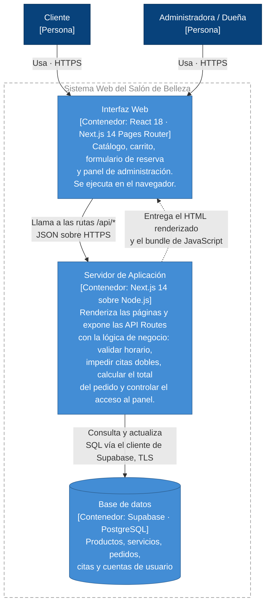

# Práctica 6 · Arquitectura C4 — Sistema Web del Salón de Belleza

**Autor:** Edgar Alejandro Paz Benavides
**Rama:** `feature/practica-6`

Este documento describe la arquitectura del sistema web del salón de belleza usando el
**modelo C4** de Simon Brown, en sus dos primeros niveles: **contexto** (nivel 1) y
**contenedores** (nivel 2). Los diagramas están escritos en Mermaid, así que GitHub los
renderiza directamente en la vista del archivo: la documentación vive junto al código y se
versiona con él.

**Qué hace el sistema:** una página web donde los clientes ven el catálogo de productos del
salón, arman un pedido y agendan citas para los servicios; y donde la dueña administra ese
catálogo, los servicios y la agenda.

---

## Stack real del proyecto

| Capa | Tecnología |
|---|---|
| Frontend | Next.js 14 (Pages Router) + React 18 |
| Backend | API Routes de Next.js |
| Base de datos | Supabase (PostgreSQL) |
| Pruebas | Vitest + Testing Library |
| Integración continua | GitHub Actions |
| Despliegue | Vercel |

> Vitest, GitHub Actions y Vercel **no aparecen como cajas en los diagramas**. El nivel 2 de C4
> modela lo que se ejecuta en producción, no la cadena de construcción ni la infraestructura de
> hospedaje. Ver la [nota de correcciones a la IA](#correcciones-que-le-hice-al-borrador-generado-con-ia).

---

## Nivel 1 · Diagrama de Contexto

Responde: *¿quién usa el sistema y con qué otros sistemas habla?* A este nivel el sistema es
una sola caja negra; no interesa cómo está construido por dentro.



### Justificación (nivel 1) — 2 decisiones con atributos de calidad

1. **Decisión 1 — usar Supabase (PostgreSQL gestionado) como sistema externo en vez de autoalojar la base de datos.**
2. Elegí Supabase porque **priorizo mantenibilidad y disponibilidad sobre portabilidad y control**: siendo un solo desarrollador, no puedo hacerme cargo de respaldos, parches de seguridad ni réplicas, y el proveedor ya resuelve eso; el precio que pago es dependencia del proveedor (*vendor lock-in*) y una latencia que no administro.
3. **Decisión 2 — dejar el cobro fuera del sistema: no hay pasarela de pago en el contexto.**
4. Elegí no integrar pagos porque **priorizo seguridad sobre usabilidad**: al no recibir ni almacenar datos de tarjeta, el sistema queda fuera del alcance de PCI-DSS y desaparece la superficie de ataque más costosa; el costo es que el cliente reserva en línea pero paga en el salón, lo cual es un paso manual más.
5. Ambas se revisarían si el volumen de pedidos justifica cobrar en línea (entraría una pasarela como sistema externo) o si el costo de Supabase supera al de administrar PostgreSQL propio — y el diagrama de contexto es justamente el artefacto donde ese cambio se vería primero.

---

## Nivel 2 · Diagrama de Contenedores

Hace *zoom* dentro de la caja del nivel 1: muestra las unidades desplegables/ejecutables del
sistema, con qué tecnología está hecha cada una y cómo se comunican entre sí.



### Justificación (nivel 2) — 2 decisiones con atributos de calidad

1. **Decisión 1 — un solo desplegable (Next.js con API Routes) en lugar de un frontend y un backend separados.**
2. Elegí el monolito modular porque **priorizo mantenibilidad y velocidad de entrega sobre escalabilidad independiente**: un repositorio, un pipeline, un despliegue y modelos de datos compartidos entre cliente y servidor, sin contratos de API que mantener sincronizados entre dos proyectos; el costo aceptado es que no puedo escalar la API sin escalar también el renderizado, algo irrelevante con el tráfico de un salón local.
3. **Decisión 2 — el navegador nunca habla directamente con Supabase: todo acceso a datos pasa por las API Routes.**
4. Elegí ese salto extra porque **priorizo seguridad sobre rendimiento**: las credenciales de servicio y las reglas de negocio (validar el horario laboral, impedir dos citas del mismo servicio a la misma hora, calcular el total del pedido) quedan del lado del servidor, donde el usuario no las puede alterar; el costo es aproximadamente un salto de red adicional por operación.
5. La decisión 2 también mejora la **testeabilidad**, que es lo que hace posible cubrir esas reglas con Vitest sin levantar un navegador — y se revisaría solo si la latencia percibida se volviera un problema medible, no por suposición.

---

## Por qué la base de datos cambia de lado entre los dos niveles

En el **nivel 1** Supabase aparece *fuera* del límite y en el **nivel 2** la base de datos aparece
*dentro*. No es una contradicción: son dos preguntas distintas sobre la misma pieza.

- Nivel 1 pregunta **quién la opera**: Supabase, un tercero fuera de mi control → sistema externo.
- Nivel 2 pregunta **de quién son los datos y el esquema**: del sistema → contenedor propio.

---

## Supuestos por confirmar

Estos puntos **no** están confirmados contra el código y por eso se modelaron de la forma más
conservadora posible. Si cambian, cambia el nivel 2:

- **Autenticación del panel de administración.** El diagrama asume que la valida el Servidor de Aplicación. Si el proyecto usa **Supabase Auth**, aparecería un contenedor adicional dentro del límite de Supabase.
- **Imágenes de los productos.** El diagrama no muestra almacenamiento de archivos. Si se usa **Supabase Storage**, hay que agregarlo como contenedor.

---

## Correcciones que le hice al borrador generado con IA

El primer borrador de estos diagramas se generó con IA a partir de la descripción *"e-commerce
y agenda de citas para un salón de belleza"*. La IA completó los huecos con lo que es
**estadísticamente común en ese tipo de proyecto**, no con lo que este proyecto realmente tiene.
Estas son las alucinaciones que encontré y corregí:

| # | Lo que puso el borrador | Por qué era una alucinación | Corrección aplicada |
|---|---|---|---|
| 1 | **Stripe / PayPal** como sistema externo de pagos | El sistema no integra ninguna pasarela; el cobro ocurre en el salón | Eliminado del nivel 1 y convertido en una decisión de diseño explícita |
| 2 | **SendGrid** para confirmaciones por correo | No hay servicio de correo contratado ni implementado | Eliminado |
| 3 | **Twilio / WhatsApp Business API** para recordatorios de cita | Misma invención: es la función "obvia" del dominio, no una que exista | Eliminado |
| 4 | Contenedores separados **"Frontend React"** y **"Backend API en Express"** | El backend son **API Routes de Next.js**: mismo proceso y mismo desplegable. No hay Express en el proyecto | Fusionados en un único contenedor "Servidor de Aplicación" |
| 5 | **MongoDB** como base de datos | La base es **Supabase/PostgreSQL**, relacional; el borrador asumió el stack MERN por inercia | Corregido a PostgreSQL |
| 6 | **Redis** como caché de sesiones | No existe. Se agregó porque "aparece" en las arquitecturas de e-commerce de referencia | Eliminado |
| 7 | **GitHub Actions** y **Vitest** dibujados como contenedores | Son herramientas de *build* y prueba: no se ejecutan en producción, y el nivel 2 de C4 modela el runtime | Sacados de los diagramas; se mencionan en la tabla de stack |
| 8 | **Vercel** como sistema externo en el nivel 1 | Es infraestructura de despliegue, no un sistema con el que se intercambian datos. Eso corresponde a un **diagrama de despliegue**, no al de contexto | Sacado del diagrama; documentado como nota |
| 9 | Actores **"Estilista"** y **"Recepcionista"** | Roles plausibles del dominio, pero no son usuarios de *este* sistema | Reducido a los dos actores reales: Cliente y Administradora |
| 10 | Sintaxis **`C4Context` / `C4Container`** de Mermaid | Es una función experimental de Mermaid que GitHub no renderiza de forma confiable — habría fallado justo el criterio de la práctica | Reescrito con `flowchart` + `classDef`, que GitHub sí renderiza, respetando la notación visual de C4 |
| 11 | La base de datos dibujada **fuera** del límite en el nivel 2 | Copió la posición del nivel 1 sin razonar el cambio de pregunta entre niveles | Movida dentro del límite y explicado el porqué en una sección propia |

**Lo que aprendí del ejercicio:** la IA no se equivoca al azar, se equivoca **hacia el promedio**.
Rellena con el stack más frecuente (MERN, Redis, Stripe) y con los actores más típicos del
dominio. Las alucinaciones más peligrosas no fueron las tecnologías inventadas — esas saltan a
la vista — sino las **conceptuales**: meter la herramienta de CI como contenedor de runtime
(#7) y copiar la posición de la base de datos entre niveles sin entender qué pregunta responde
cada nivel (#11). Esas dos se ven correctas y aun así hacen que el diagrama mienta.

---

## Cómo verificar que los diagramas renderizan

1. Abrir este archivo en GitHub (vista normal del archivo, no *Raw*).
2. Ambos bloques ` ```mermaid ` deben verse como diagramas, no como texto.
3. Si se ve el código en crudo, hay un error de sintaxis: probarlo en <https://mermaid.live>.
