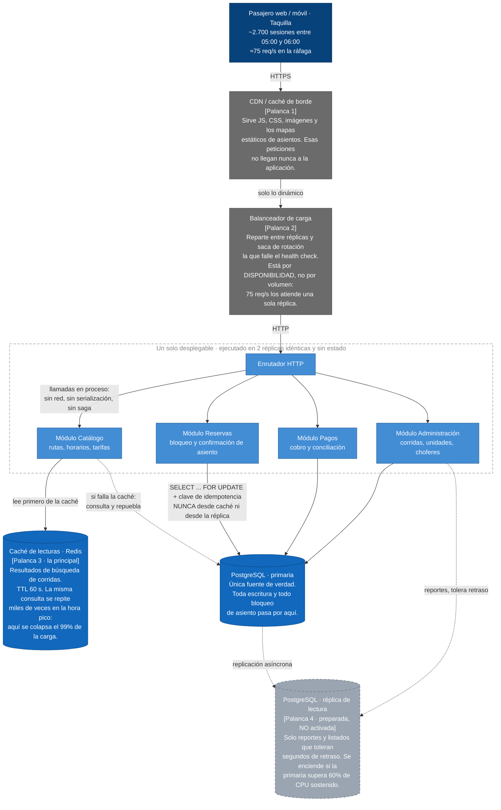

# ADR-001 · Arquitectura de la plataforma de venta de boletos

|  |  |
|---|---|
| **Estado** | Aceptada |
| **Fecha** | 2026-09-07 |
| **Autor** | Edgar Alejandro Paz Benavides |
| **Rama** | `feature/practica-7` |
| **Decide** | Equipo de desarrollo (3 personas) |
| **Consultado** | Gerencia de la cooperativa, jefe de taquillas |
| **Reemplaza a** | — |

---

## 1 · Contexto

La plataforma de venta de boletos de la cooperativa de buses creció hasta **50.000 usuarios
registrados**. La venta no está repartida a lo largo del día: se concentra en una **ráfaga entre
las 05:00 y las 06:00**, cuando el pasajero compra el boleto del primer turno o revisa la corrida
antes de salir de su casa. Fuera de esa ventana el tráfico es bajo y de madrugada es casi nulo.

La gerencia pidió **migrar a microservicios**. El pedido no vino acompañado de un problema
medido: vino de un artículo de LinkedIn. Este ADR existe para que esa decisión —tomarla o no—
quede escrita con números y con atributos de calidad, y para que el equipo del año que viene no
tenga que re-litigarla a ciegas.

### 1.1 Presupuesto de carga estimado

Los siguientes son **supuestos declarados**, no mediciones. Están puestos aquí para que
cualquiera pueda discutirlos con datos en vez de con opiniones.

| Magnitud | Valor estimado | De dónde sale |
|---|---|---|
| Usuarios registrados | 50.000 | Dato dado |
| Usuarios activos en el día pico | ~12% → 6.000 sesiones | Supuesto conservador para transporte interprovincial |
| Sesiones dentro de la ventana 05:00–06:00 | ~45% → **2.700 sesiones** | Supuesto derivado del pico descrito |
| Peticiones por sesión | ~25 (buscar, ver corridas, mapa de asientos, pagar) | Supuesto |
| **Peticiones en la hora pico** | **~67.500 → 18,7 req/s promedio** | Cálculo |
| **Ráfaga dentro de la hora** (factor 4) | **~75 req/s** | Cálculo |
| Boletos confirmados en la hora pico | ~900 → **0,25 escrituras/s** | Supuesto |
| **Relación lectura : escritura** | **≈ 75 : 1** | Cálculo |

### 1.2 Qué dice ese presupuesto

**75 req/s no es un problema de escala.** Es carga que un solo proceso bien escrito atiende sin
despeinarse; la referencia habitual para un backend con caché tibia está uno o dos órdenes de
magnitud por encima. El problema **no es de volumen, es de forma**:

1. **Es abrumadoramente de lectura.** 75 lecturas por cada escritura, y esas lecturas son *la
   misma consulta repetida*: "Cochabamba → Santa Cruz, hoy, 06:00". Miles de personas piden la
   misma respuesta en la misma hora, y esa respuesta cambia poco.
2. **La escritura es minúscula pero no admite error.** 0,25 escrituras por segundo, pero cada una
   compromete un asiento físico. Vender dos veces el mismo asiento es una falla que se descubre
   en la puerta del bus, delante del pasajero, y no se puede compensar con un correo de disculpa.
3. **La ráfaga es previsible.** Ocurre todos los días a la misma hora. No es un pico aleatorio que
   exija elasticidad automática: se puede tener capacidad puesta antes de que llegue.
4. **El tráfico cae a casi cero entre la 01:00 y las 05:00.** Esto es relevante y se retoma en la
   evaluación de *serverless*.

### 1.3 Atributos de calidad priorizados

Priorizar significa **ordenar**, y ordenar significa que algo queda abajo. Este es el orden que
usa el resto del documento:

| # | Atributo | Prioridad | Por qué en esta cooperativa |
|---|---|---|---|
| 1 | **Integridad transaccional del asiento** | Crítica | Un asiento vendido dos veces es un pasajero de pie y una queja en ventanilla. Es el único error del sistema que no tiene arreglo automático |
| 2 | **Disponibilidad en la ventana 05:00–06:00** | Crítica | Toda la venta del día se juega ahí. Una caída de 10 minutos a las 05:20 cuesta más que una de 3 horas a las 15:00 |
| 3 | **Latencia de búsqueda (p95)** | Alta | El pasajero compara horarios entre cooperativas. Si la búsqueda tarda, compra en otro lado |
| 4 | **Operabilidad con 3 desarrolladores** | Alta | No hay equipo de plataforma, no hay turno de guardia. Lo que se despliegue lo mantienen las mismas 3 personas que escriben las funcionalidades |
| 5 | **Costo de infraestructura** | Alta | Es una cooperativa, no una startup con capital de riesgo. El gasto mensual sale del margen por boleto |
| 6 | Escalabilidad independiente por módulo | **Baja** | Ningún módulo tiene un perfil de recursos distinto del resto. Todos hacen lo mismo: leer y escribir en la misma base |
| 7 | Autonomía de despliegue entre equipos | **Nula** | Hay **un** equipo. No existe el conflicto que esta propiedad resuelve |

Los atributos 6 y 7 son exactamente los que justifican microservicios, y son exactamente los dos
que este caso no necesita. Ese es el eje de la decisión.

---

## 2 · Opciones evaluadas

### Opción A · Seguir como está y escalar verticalmente (línea base)

Una sola instancia, más grande cuando haga falta. Sin caché, sin balanceador, sin réplicas.

| Pros para este caso | Contras para este caso |
|---|---|
| Costo mínimo y cero complejidad operativa | **Punto único de falla en la hora que importa**: si el proceso muere a las 05:20, la venta del día se pierde. Choca de frente con el atributo 2 |
| La integridad del asiento es trivial: una base, una transacción | Todo despliegue es una interrupción, y la ventana segura para desplegar se vuelve estrechísima |
| Ningún problema de consistencia | La lectura repetida golpea la base sin filtro: la primaria trabaja de más para responder mil veces lo mismo |

**Descartada.** No por rendimiento —aguantaría los 75 req/s— sino por **disponibilidad**. No
tener a dónde caer en la única hora que factura es un riesgo que no se compensa con el ahorro.

---

### Opción B · Microservicios (lo que pidió la gerencia)

Descomponer en servicios desplegables por separado —catálogo, reservas, pagos, notificaciones,
administración— cada uno con su base de datos, comunicándose por red.

| Pros para este caso | Contras para este caso |
|---|---|
| Permitiría escalar solo Reservas durante el pico… | …pero Reservas hace **0,25 escrituras/s**. Es el componente que menos necesita escalar. La escalabilidad independiente se aplicaría a un módulo que no tiene problema de carga |
| Aislamiento de fallos: una caída de Notificaciones no tumbaría la venta | Ese mismo aislamiento se consigue hoy con una cola y un *feature flag*, sin partir el sistema |
| Libertad de stack por servicio | El equipo son 3 personas que usan un solo stack. La libertad no se ejercería |
| Límites de módulo forzados por la red | **Rompe la transacción del asiento.** Hoy reservar es `BEGIN; SELECT … FOR UPDATE; INSERT; COMMIT;` en una sola base. Repartido, se vuelve una *saga* con compensaciones, estados intermedios y ventanas de inconsistencia — convierte un problema **resuelto** en uno **abierto**, y justo sobre el atributo #1 |
| | **Multiplica el costo operativo por 3 personas**: 5 pipelines, 5 juegos de secretos, 5 tableros, trazabilidad distribuida, versionado de contratos, orquestación. Nadie de guardia para sostenerlo |
| | **Agrega latencia donde más duele**: llamadas que hoy son en proceso pasan a ser saltos de red. El p95 empeora precisamente a las 05:00 |
| | **Depurar a las 5 de la mañana** un fallo repartido en 5 servicios, sin trazabilidad distribuida montada, con el gerente llamando |
| | Ley de Conway: los microservicios reflejan fronteras **de equipos**. Con un solo equipo, se paga el costo de coordinación sin recibir el beneficio |

**Descartada.** Resuelve un problema organizacional que la cooperativa no tiene, y a cambio pone
en riesgo el atributo mejor rankeado.

---

### Opción C · Serverless / FaaS

Cada endpoint como función gestionada, facturada por invocación, con escalado automático.

| Pros para este caso | Contras para este caso |
|---|---|
| Cero costo entre la 01:00 y las 05:00, cuando no hay tráfico | **Los arranques en frío caen justo en el pico.** Con el tráfico en cero desde la 01:00, a las 05:00 *todo* está frío: la primera oleada —la más valiosa— paga la penalización de arranque. Es el peor perfil posible para FaaS |
| El escalado del pico sería automático | Pagar *concurrencia aprovisionada* para evitarlo elimina el ahorro que era el argumento principal |
| Menos infraestructura que administrar | **Agotamiento de conexiones a PostgreSQL**: N funciones concurrentes abren N conexiones. Obliga a meter un *pooler* (pgbouncer / proxy gestionado), o sea infraestructura nueva para arreglar un problema que la opción no tenía antes |
| Buen encaje para trabajo asíncrono | El bloqueo de asiento con `FOR UPDATE` encaja mal con funciones efímeras y reintentos automáticos: **un reintento sin clave de idempotencia vende el asiento dos veces** |
| | Depuración y pruebas locales notablemente peores para un equipo chico |

**Descartada como arquitectura principal**, pero **adoptada parcialmente**: ver §3.2.

---

### Opción D · Monolito modular con palancas de escala explícitas ← **elegida**

Un solo desplegable con fronteras internas de módulo verificadas en CI, ejecutado en varias
réplicas sin estado, con caché de lecturas y una réplica de base de datos preparada.

| Pros para este caso | Contras para este caso |
|---|---|
| **La transacción del asiento sigue siendo una transacción de base de datos.** El atributo #1 se conserva sin trabajo adicional | Un despliegue malo afecta a todo el sistema: no hay aislamiento por servicio |
| **Ataca el problema real**: la lectura repetida se resuelve con caché, que es donde está el 99% de la carga | Las fronteras entre módulos las sostiene la disciplina y el CI, no la red: si se afloja, degenera en un ovillo |
| Disponibilidad por réplicas + balanceador: sin punto único de falla, y despliegues sin corte | Un solo stack tecnológico para todo |
| Costo operativo compatible con 3 personas: un pipeline, un tablero, un juego de registros | Techo vertical: llegará un punto en que una réplica no alcance — con ~50× de margen sobre la carga actual |
| Latencia mínima: llamadas entre módulos en proceso, sin serialización ni red | La caché introduce datos ligeramente viejos en la búsqueda (se trata en §4) |
| Deja abierto el camino: extraer un módulo a servicio después es viable **porque las fronteras ya existen** | |

---

### 2.1 Comparación contra los atributos priorizados

Puntuación: ● cumple bien · ◐ cumple con esfuerzo · ○ no cumple o lo empeora.

| Atributo (por prioridad) | A · Vertical | B · Microservicios | C · Serverless | **D · Monolito modular** |
|---|:---:|:---:|:---:|:---:|
| 1 · Integridad del asiento | ● | ○ | ○ | **●** |
| 2 · Disponibilidad 05:00–06:00 | ○ | ◐ | ◐ | **●** |
| 3 · Latencia p95 de búsqueda | ◐ | ○ | ○ | **●** |
| 4 · Operabilidad con 3 devs | ● | ○ | ◐ | **●** |
| 5 · Costo de infraestructura | ● | ○ | ◐ | **◐** |
| 6 · Escalabilidad independiente *(prioridad baja)* | ○ | ● | ● | ○ |
| 7 · Autonomía de despliegue *(prioridad nula)* | ○ | ● | ◐ | ○ |

Microservicios y *serverless* ganan **exactamente en las dos filas que la cooperativa declaró
como baja y nula prioridad**, y pierden en las tres críticas. Esa es la decisión, y no depende de
cuál arquitectura esté de moda.

---

## 3 · Decisión

> **Adoptamos un monolito modular desplegado en réplicas, con caché de lecturas, balanceador y
> una réplica de lectura preparada. No migramos a microservicios.**

El razonamiento en una frase: **nuestro problema es lectura repetida en una ventana previsible,
no organización de equipos.** La caché resuelve el problema real por un costo marginal; los
microservicios resuelven un problema que no tenemos y nos cobran la integridad del asiento a
cambio.

### 3.1 Diagrama de la decisión y sus palancas de escala

Solo aparecen las palancas que la carga estimada justifica. No hay *sharding*, ni bus de
mensajes en el camino crítico, ni autoescalado por servicio: nada de eso tiene un problema que
resolver con 75 req/s.



### 3.2 Justificación de cada palanca

| Palanca | Por qué está | Por qué **no** hay más |
|---|---|---|
| **1 · CDN** | La mayoría de las peticiones del pico son estáticos. Sacarlos del camino es lo más barato que se puede hacer | — |
| **2 · Balanceador + 2 réplicas** | Responde al atributo **2**: elimina el punto único de falla y habilita despliegue progresivo sin corte. Exige sacar la sesión de la memoria del proceso | Con 3 réplicas ya se paga capacidad ociosa 23 horas al día |
| **3 · Caché de lecturas** | Responde al atributo **3** y es la palanca de mayor efecto: la búsqueda de corridas es idéntica para miles de usuarios y cambia poco en 60 segundos | La caché **no** cubre el momento de compra: ahí se lee de la primaria (ver §4) |
| **4 · Réplica de lectura** | Preparada, no encendida. Se activa por métrica, no por intuición | Encenderla ahora sería complejidad sin problema: la caché ya absorbe la lectura |
| **Clave de idempotencia + `FOR UPDATE`** | No es una palanca de escala sino de **corrección bajo ráfaga**: a las 05:00 los usuarios reintentan, y sin idempotencia el reintento compra dos veces | — |

**Lo único que sí tomamos de la Opción C:** las tareas asíncronas y periféricas —envío de correo
y SMS de confirmación, generación de reportes nocturnos, conciliación con la pasarela— se
ejecutan **fuera del camino crítico**, en trabajadores disparados por cola. Ahí el arranque en
frío es irrelevante y el aislamiento sí vale. Eso no convierte la arquitectura en *serverless*:
es una decisión de dónde poner lo que no debe bloquear una venta.

---

## 4 · Consecuencias

### 4.1 Lo que aceptamos perder

1. **Escalabilidad y despliegue independientes por módulo.** Un despliegue defectuoso afecta a
   todo el sistema. *Mitigación:* despliegue progresivo réplica por réplica, *feature flags* y
   reversión automática si el health check falla. *Riesgo residual asumido.*
2. **Un solo stack tecnológico.** Si mañana conviene otro lenguaje para un componente, no se
   puede sin extraerlo primero. Con 3 personas, esto es un beneficio disfrazado de costo.
3. **Datos ligeramente viejos en la búsqueda.** Con TTL de 60 s, un pasajero puede ver un asiento
   que se ocupó hace 40 segundos y recibir el rechazo al pagar. *Se acepta:* la alternativa es
   golpear la primaria en cada búsqueda. *Mitigación:* la disponibilidad en la lista se muestra
   como aproximada, y la verdad se resuelve en el `FOR UPDATE` del checkout, que nunca lee de
   caché. **Nunca se cachea el estado del asiento en el momento de la compra.**
4. **Las fronteras entre módulos no las obliga la red.** Sostenerlas depende de disciplina.
   *Mitigación:* regla de importaciones verificada en CI —un módulo solo puede llamar a otro por
   su interfaz pública— y el PR se bloquea si se viola. Sin esta regla, la decisión se degrada
   sola con el tiempo.
5. **Techo vertical.** Existe, y está aproximadamente 50 veces por encima de la carga actual. Se
   monitorea, no se anticipa con arquitectura.
6. **Costo político.** Le decimos que no a la gerencia. *Mitigación:* este documento, más los
   disparadores de §5, que convierten "no" en "todavía no, y estas son las condiciones exactas".

### 4.2 Lo que ganamos

- La regla de negocio más delicada —un asiento, un pasajero— sigue protegida por una transacción
  de base de datos y no por una saga distribuida.
- Un pipeline, un tablero, un juego de registros: operable por el equipo que realmente existe.
- La caché ataca el 99% de la carga con una fracción del esfuerzo de partir el sistema.
- Fronteras de módulo ya trazadas: **si algún día hace falta extraer un servicio, el trabajo duro
  —encontrar el corte— ya está hecho.** Esta decisión no cierra la puerta a microservicios; la
  deja preparada para el día en que haya una razón.

---

## 5 · Cuándo revisar esta decisión

Este ADR se reabre si ocurre **cualquiera** de estos hechos —hechos medidos, no opiniones:

| Disparador | Umbral concreto |
|---|---|
| El equipo crece y los despliegues se traban entre sí | ≥ 3 equipos con cadencia de despliegue propia |
| La caché deja de alcanzar | Tasa de aciertos > 90% **y aun así** p95 > 400 ms en la ventana pico, **con** la réplica de lectura ya activa |
| Un módulo desarrolla un perfil de recursos distinto | Ej.: analítica/BI o un recomendador de rutas que consuma CPU o memoria de otro orden |
| La suite de pruebas frena la entrega | Pipeline > 20 minutos de forma sostenida |
| El perfil de carga cambia de forma | La relación lectura:escritura baja de 10:1, o el pico deja de ser previsible |

**Orden de extracción si llega el momento:** primero Notificaciones, después Reportes/Analítica,
después Pagos. **Reservas se extrae al final o nunca**, porque es la que sostiene la invariante
de asiento único y es la que más pierde al cruzar la red.

### 5.1 Qué tendría que ser cierto para que microservicios fuera la respuesta correcta

Puesto en negativo, para que la decisión sea falsable y no una preferencia:

- Que hubiera varios equipos bloqueándose entre sí en el despliegue → **hay un equipo de 3.**
- Que algún componente necesitara escalar en un orden distinto al resto → **el componente de
  escritura hace 0,25 op/s.**
- Que el volumen excediera lo que un nodo puede atender → **75 req/s está ~50× por debajo.**
- Que la operación distribuida fuera sostenible → **no hay turno de guardia ni trazabilidad
  distribuida montada.**
- Que el dominio no tuviera una invariante transaccional fuerte → **la tiene, y es el núcleo del
  negocio.**

Cinco condiciones, cero cumplidas. **"Es lo moderno" no aparece en la lista porque no es un
atributo de calidad: no se puede medir, no se puede probar y no se puede incumplir.**

---

## 6 · Cómo verificar que la decisión funcionó

Objetivos de servicio contra los que se evalúa este ADR en 90 días —al 2026-12-06:

| Métrica | Objetivo |
|---|---|
| p95 de búsqueda de corridas, ventana 05:00–06:00 | < 400 ms |
| Disponibilidad en la ventana 05:00–06:00 | ≥ 99,5% |
| Asientos vendidos dos veces | **0** |
| Tasa de aciertos de la caché en búsqueda | > 85% |
| CPU sostenida de la primaria en el pico | < 60% |
| Costo mensual de infraestructura | Dentro del presupuesto vigente |

Si estas seis se cumplen, la decisión fue correcta y no hay nada que migrar. Si falla alguna, el
disparador correspondiente de §5 dice qué mirar — y ninguno de ellos empieza por reescribirlo
todo.

---

## 7 · Cómo verificar que el diagrama renderiza

1. Abrir este archivo en GitHub (vista normal, no *Raw*).
2. El bloque ` ```mermaid ` debe verse como diagrama, no como texto.
3. Si aparece el código en crudo, hay un error de sintaxis: probarlo en <https://mermaid.live>.
